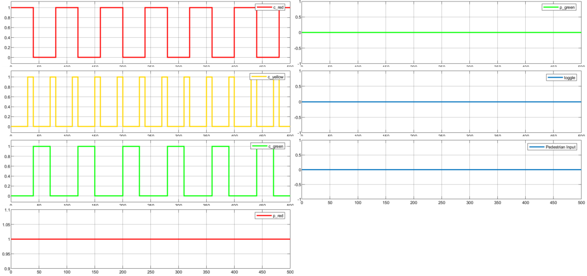

# Traffic-Light-Control-System---A-Model-Based-Software-Design-Approach
In this project, a Traffic Light Control System (TLCS) using Model-Based Software Design approch. The project implements according to Agile Software Development Process, which starts with project planning and lists system requirement in a Requirement Specification Sheet. Then the TLCS system architecture is developed using a software design approach. Later, utilizing Simulink/State Flow Graphs, a Software Design Block diagram is created and put into use. Following that, a test harness is made, and several test cases are checked to see if the project's criteria were being satisfied.

The task is to create a new traffic light control system that manages the lights for pedestrians and autos automatically. The system must respond to push-button requests made by the user. An optical indication must be used to signify the requests. The following exclusive states are possible for automobile lights:

- green
- yellow
- red
- red-yellow

The exclusive states for pedestrian lights are green and red. On either side of the road, the control system must control a pedestrian light, a push button, and an optical indicator. Pushbutton activities on one side must also be indicated on the other. There is one light in each direction for the autos. The following figure depicts a more clear concept of the project.

 |  |
 |:--:| 
 | *System Block Diagram* |
 
 The following four main requirements were employed in the test verification process to implement the TLCS:
 
- Vehicle stopping
- Vehicle pre-crossing
- Vehicle crossing
- Vehicle post-crossing

The Finite State Machine (FSM) is implementated using State Flow Graphs follows the pattern as shown in the table below.

<table>
  
  <tr>
    <td colspan="5">
<strong>Individual State Durations (sec) </strong>
 </td>
  </tr>
 
  <!--- <tr> (Comments)
  []: # <td rowspan="1"><b> States </b></td>
  []: # <td colspan="2"><b> Push button pressed</b> </td>
  []: # <td colspan="2"><b> Push button not pressed </b></td>
  []: # </tr> -->
 
  
  <tr>
    <td>
<b>States<b>
</td>
    <td>
Individual state time
</td>
    <td>
Time elasped
</td>
  </tr>
  
  
   <tr>
    <td>Vehicle Stopping</td>
    <td>
30
</td>
    <td>
30
</td>
  </tr>
 
   <tr>
    <td>Vehicle Pre-crossing</td>
    <td>
5
</td>
    <td>
35
</td>
  </tr>
 
   <tr>
    <td>Vehicle Crossing</td>
    <td>
30
</td>
    <td>
1 min 05
</td>
  </tr>
 
   <tr>
    <td>Vehicle Post-crossing</td>
    <td>
5
</td>
    <td>
1 min 10
</td>
  </tr>
</table>

According to above logic, FSM is developed in MATALAB/Simulink/Sate Flow Graphs as shown in below figure.

|  |
|:--:| 
| *FSM Design* |

The overview of the system that is executed and tested are given below.

|  |
|:--:| 
| *TLC Module* |

## Testing and Verfication

**Test 1**

When there is no pedestrian input (signal from test builder), vechiles traffic light system works continuously without any disturbance. The pedestrian traffic red signal remain ON and green signal remain OFF.

|  |
|:--:| 
| *Test 1* |

**Test 2**

If the pedestrian push button pressed when there is less than 20 seconds remains to switch the vehicle traffic signal red light to yellow, the pedestrian green light ON when the vehicle traffic red light ON next- time.

|  |
|:--:| 
| *Test 2* |

**Test 3**

When the vehicle traffic signal green light in ON, the pedestrian green light is not ON, its ON when the vehicle traffic red light ON.

|  |
|:--:| 
| *Test 3* |

**Test 4**

When the pedestrian green light in ON, the system do not respond the pedestrian push button and also not increase the ON time of pedestrian green light.

|  |
|:--:| 
| *Test 4* |

**Test 5**

For random presses of pedestrian push button, the system responds the request when it requires.

|  |
|:--:| 
| *Test 5* |

Thank you for visiting my account. I wish you a good day! 🙂
